# Pipeline Diagram — pipeline-redesign-v2 (planned)

Two formats. Use whichever your target tool understands:

- **Mermaid** (§1) — renders inline on GitHub, GitLab, Notion, Obsidian,
  draw.io, mermaid.live, and most modern markdown viewers. Definitive
  source of truth — change this when the architecture changes.
- **Natural-language prompt** (§2) — paste into ChatGPT image, DALL-E,
  Midjourney, Stable Diffusion, Whimsical AI, Eraser.io AI, or any
  diagram-from-prose tool. Use for marketing slides / paper figures.

Both reflect the **planned v2 architecture** (post pipeline-redesign-v2,
not the legacy pre-Phase-1 pipeline). For the legacy file-by-file flow
see [`PIPELINE.md`](../PIPELINE.md). For the design rationale see
[`.kiro/specs/pipeline-redesign-v2/requirements.md`](../.kiro/specs/pipeline-redesign-v2/requirements.md).

---

## 1. Mermaid source

```mermaid
flowchart LR
    %% --- Inputs (left) ---
    JOBS[(Job postings<br/>scraped from<br/>LinkedIn/Indeed/...)]
    FUTURE[(Future-domain refs<br/>WEF · O*NET · McKinsey)]
    CURR[(Curriculum upload<br/>SMK admin)]

    %% --- Preprocess ---
    JOBS --> PRE
    PRE["1. Preprocessing<br/><i>sentence split · dedup<br/>translation · KKNI extraction</i><br/><b>provenance: sentence_id</b>"]
    PRE --> REL

    %% --- Relevance filter ---
    REL["2. Sentence Relevance Filter<br/><i>zero-shot LLM<br/>SHA-256 cache</i><br/>drops benefits, logistics, boilerplate"]
    REL --> EXT

    %% --- Hybrid extraction ---
    subgraph EXT ["3. Hybrid Extraction"]
        direction TB
        BERT["BERT path<br/>Skill-LLM<br/><i>LoRA LLaMA 3.1 8B</i><br/>per-sentence"]
        LLM["LLM path<br/><i>DeepSeek-V3</i><br/>full-posting arbitration"]
        FUSE{{"Fusion Engine<br/><i>SBERT-based</i>"}}
        BERT --> FUSE
        LLM --> FUSE
    end

    EXT --> CLUST
    EXT --> FDM
    EXT --> TREND

    %% --- Parallel branches off extraction ---
    FUTURE --> FDM
    FDM["Future-Domain Mapping<br/><i>SBERT cosine similarity</i>"]

    TREND["Trend Analysis<br/><i>linear regression<br/>+ FDR (Benjamini-Hochberg)</i><br/>Emerging · Declining · Stable"]

    %% --- Clustering ---
    CLUST["4. Skill Clustering<br/><i>HDBSCAN + Agglomerative</i><br/>winner per batch by SBERT cohesion"]
    CLUST --> COMP

    %% --- Competency generation ---
    COMP["5. Competency Generation<br/><i>LLM cluster-driven</i><br/>contributing_item_ids<br/>source_sentences"]
    COMP --> KKNI
    COMP --> EDU
    COMP --> EVAL

    %% --- Post-hoc labelers ---
    KKNI["6. KKNI Labeler<br/><i>SBERT vs Perpres 8/2012</i><br/>levels 1–9 (informational)"]
    EDU["7. Education-Level<br/>Aggregation<br/><i>per-competency histogram</i>"]

    %% --- Evaluator ---
    EVAL["8. Competency Evaluator<br/><i>grounding · coherence · coverage</i><br/>hallucination flag"]

    %% --- Ranking ---
    KKNI --> RANK
    EDU --> RANK
    FDM --> RANK
    TREND --> RANK
    EVAL --> RANK

    RANK["9. Recommendation Ranking<br/><b>priority = 0.40·demand<br/>+ 0.30·trend + 0.30·future</b>"]

    %% --- Coverage analyzer ---
    CURR --> COV
    RANK --> COV
    COV{{"Coverage Analyzer<br/><i>SBERT semantic match</i><br/>covered · partial · gap"}}

    %% --- Outputs ---
    RANK --> PUB
    RANK --> SCH
    COV --> SCH

    PUB(["Public Dashboard<br/>browse · detail with<br/>provenance chain"])
    SCH(["School Admin Dashboard<br/>curriculum coverage report<br/>+ admin publish gate"])

    %% --- Cross-cutting (annotation only) ---
    HITL["Human-in-the-loop<br/><i>expert review · gold labels<br/>Cohen's / Fleiss' Kappa</i>"]
    HITL -.audit.-> EXT
    HITL -.audit.-> COMP
    HITL -.audit.-> EVAL

    %% --- Styling ---
    classDef input fill:#e0f2fe,stroke:#0284c7,color:#0c4a6e;
    classDef output fill:#dcfce7,stroke:#16a34a,color:#14532d;
    classDef stage fill:#fef3c7,stroke:#ca8a04,color:#713f12;
    classDef parallel fill:#fae8ff,stroke:#a21caf,color:#581c87;
    classDef hitl fill:#fee2e2,stroke:#dc2626,color:#7f1d1d,stroke-dasharray: 5 5;

    class JOBS,FUTURE,CURR input;
    class PUB,SCH output;
    class PRE,REL,EXT,CLUST,COMP,KKNI,EDU,EVAL,RANK stage;
    class FDM,TREND,COV parallel;
    class HITL hitl;
```

To preview / export:

- **GitHub / GitLab:** automatically renders inline.
- **mermaid.live:** paste source → export PNG/SVG.
- **draw.io:** Arrange → Insert → Advanced → Mermaid.
- **Obsidian / Notion:** built-in Mermaid blocks.

---

## 2. Natural-language prompt for AI image generators

Paste this into ChatGPT (with image generation), DALL-E 3, Midjourney
(use `--ar 16:9 --s 250`), Stable Diffusion, Whimsical AI, or Eraser.io.
Tweak the style line at the bottom for your output medium (slide vs.
paper vs. dashboard hero).

> **Subject:** A clean technical architecture diagram titled *"Future-Aware Hybrid Skill Extraction Pipeline — for Indonesian SMK curriculum reform"*. Horizontal flow, left-to-right, three swim-lane band: inputs · processing · outputs.
>
> **Inputs (left, light blue rounded rectangles, document/globe icons):**
> Job postings (scraped from LinkedIn / Indeed / JobStreet); Future-domain references (WEF · O\*NET · McKinsey); Curriculum upload from SMK administrators.
>
> **Processing stages (center, soft yellow rounded rectangles, numbered 1–9, connected by solid arrows showing main flow):**
>
> 1. **Preprocessing** — sentence splitting, deduplication, translation, KKNI education-level extraction. Annotation: "provenance: every item carries `sentence_id`".
> 2. **Sentence Relevance Filter** — zero-shot LLM drops irrelevant sentences (benefits, logistics, boilerplate); persistent SHA-256 cache for cost-zero re-runs.
> 3. **Hybrid Extraction** — a sub-group with two parallel paths converging into a "Fusion Engine" diamond:
>    - BERT path: Skill-LLM (LoRA-fine-tuned LLaMA 3.1 8B) per-sentence, emits structured JSON with verb-led SKILL and noun KNOWLEDGE.
>    - LLM path: DeepSeek-V3 on full posting, arbitrates ambiguous categorizations using surrounding context.
> 4. **Skill Clustering** — HDBSCAN + Agglomerative; the winner per batch is selected by mean intra-cluster SBERT cohesion.
> 5. **Competency Generation** — LLM synthesizes competency statements from each cluster, with full provenance (contributing item IDs + source sentences).
> 6. **KKNI Labeler** (post-hoc) — SBERT match against Perpres 8/2012 level descriptors 1–9 (informational only, does not enter ranking).
> 7. **Education-Level Aggregation** — per-competency histogram of education requirements from contributing job postings.
> 8. **Competency Evaluator** — grounding score, coherence score, coverage score; flags potential hallucinations.
> 9. **Recommendation Ranking** — `priority_score = 0.40 · demand + 0.30 · trend + 0.30 · future_weight`.
>
> **Parallel branches (soft purple rounded rectangles, dotted lines tapping off the Hybrid Extraction stage):**
> - **Future-Domain Mapping** — SBERT cosine similarity to WEF / O\*NET / McKinsey domain descriptors.
> - **Trend Analysis** — linear regression with FDR (Benjamini-Hochberg) on monthly skill frequency, classifying skills as Emerging / Declining / Stable.
>
> Both feed into the Recommendation Ranking stage.
>
> **Coverage Analyzer (soft purple, fed by both Curriculum upload and the ranked recommendations):** SBERT semantic match between user-uploaded curriculum text and generated competencies; reports covered / partially-covered / gap.
>
> **Outputs (right, light green rounded rectangles, dashboard icons):**
> - Public Dashboard (browse + detail page with provenance chain — "Why this competency?")
> - School Admin Dashboard (curriculum coverage report + admin publish-gate)
>
> **Cross-cutting annotations (red dashed callouts above the main flow):**
> - "Human-in-the-loop: expert review at extraction + competency stages, Cohen's / Fleiss' Kappa"
> - "Provenance throughout: every output traces back to source job_id + sentence_id + sentence_text"
>
> **Style:** Modern flat-design infographic. Soft pastel palette (light blue inputs, soft yellow processing stages, soft purple parallel branches, light green outputs, red dashed lines for human-in-the-loop annotations). Rounded corners on all rectangles. Solid arrows for the primary data flow; dotted arrows for parallel branches; dashed red lines for human-in-the-loop callouts. Minimum text inside boxes — prefer concise labels with small icons. Subtle Indonesian SMK education context (a small batik motif accent in one corner, a KKNI badge somewhere visible). All technical labels in English. Aspect ratio 16:9, landscape, sized for slide-deck use.

---

## 3. Notes on what's drawn and what isn't

The diagram **shows** the planned post-redesign-v2 architecture: every
component listed in `.kiro/specs/pipeline-redesign-v2/requirements.md`
is represented at least as a labeled box, and the cross-cutting
provenance + human-in-the-loop invariants are called out.

The diagram **omits**:

- Internal subroutines of each stage (e.g., the seqeval span-set F1
  computation inside the evaluator, or the BIO-to-span reduction inside
  the BERT path). Those belong in lower-level diagrams attached to
  each component's `AUDIT.md` if needed.
- The data store layer (SQLite/Postgres) — present in deployment but
  not part of the conceptual pipeline.
- The legacy ablation paths (`--extraction-mode llm_only` /
  `bert_only`). They're retained per Req 9.3–9.4 but not shown to keep
  the main flow clear.
- The legacy domain-batching path that 4. Skill Clustering replaces
  (per Req 5.5).

If you need a variant that includes any of the above, paste the
Mermaid source into a fresh file and edit there — keep this file as
the canonical "planned production architecture" view.
