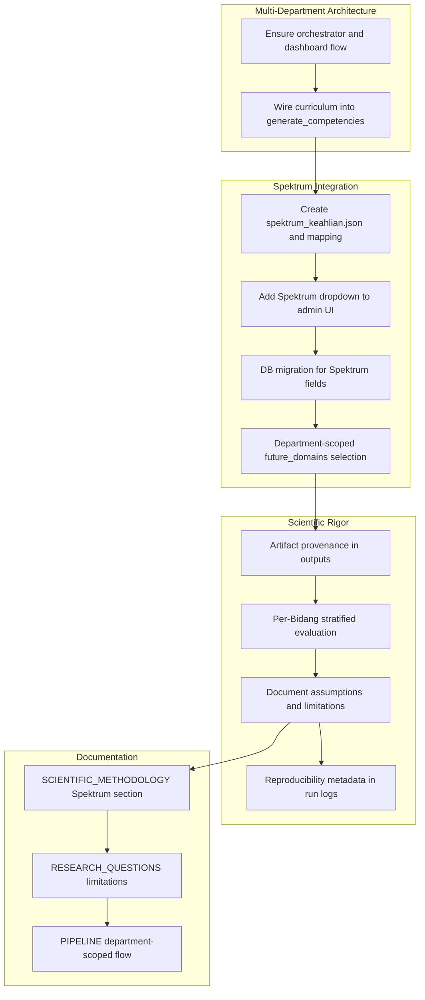

# Multi-Department Pipeline (Merged)

**Merged from:** Multi-Department Pipeline Plan + Multi-Department Pipeline: Spektrum Keahlian and Scientific Rigor

This plan covers the **department-scoped pipeline architecture**, integration of the **Spektrum Keahlian** (official Indonesian vocational taxonomy), and **scientific rigor** for defensible research outcomes.

---

## 1. Multi-Department Pipeline Architecture

### 1.1 Overview

The pipeline runs per department with isolated outputs. Each department has its own uploads, preprocessing, results, and feedback store. The default pipeline (`run.bat`, `run_phase_2.bat`) remains unchanged; the orchestrator uses path overrides.

### 1.2 Paths and Structure

| Scope | Path |
|-------|------|
| Department base | `data/schools/{school_id}/departments/{department_id}/` |
| Uploads | `.../uploads/` (jobs_*, curriculum_*) |
| Preprocessing | `.../preprocessing/data_prepared/` |
| Results | `.../results/` |
| Feedback | `.../feedback_store/` |
| Logs | `.../logs/latest_run.json` |

**Fallback:** If no jobs upload exists, the orchestrator returns fallback metadata and does not run scripts; dashboard may show default `DATA/results` or project `results/`.

### 1.3 Orchestrator Flow

[pipeline_orchestrator.py](pipeline_orchestrator.py):

- **Phase 1** (`run_department_pipeline`): Preprocess jobs → pipeline.py → verify_skills → future_weight_mapping (jobs + skills) → enrich_with_dates → skill_time_trend_analysis → generate_competencies → recommendations → export_for_review → export_gold_set → merge_gold_labels → export_competencies_for_review → evaluate_extraction → plot_scientific_analysis
- **Phase 2** (`run_department_phase2`): import_feedback → apply_feedback → validate_parameters → verify_skills → generate_competencies --comprehensive → export_competencies_for_review → evaluate_competency_generation → skill_time_trend_analysis → recommendations → evaluate_extraction → evaluate_future_mapping → log_run_metadata → plot_generator → plot_scientific_analysis

### 1.4 Dashboard Integration

- **Admin → Departments:** Create departments with `name` and `vocational_field` (currently free text).
- **School → Upload:** Jobs (CSV) and curriculum (CSV/JSON) per department.
- **School → Runs:** Trigger `run_department_pipeline` or `run_department_phase2` per department.
- **School → Results:** Aggregation by `vocational_field` across schools (same field → combined results).
- **Global `future_domains.csv`:** Used by `future_weight_mapping.py`; currently IT/software-focused.

### 1.5 Gaps and Extension Points

- **Curriculum integration:** Curriculum upload is tracked but not yet wired into `generate_competencies.py` (e.g., `--domain` / `vocational_field` parameterization).
- **Department-specific domains:** `future_domains.csv` is global; department-scoped selection (by Spektrum) is planned below.

---

## 2. Spektrum Keahlian Integration

**Source:** Keputusan Menteri Pendidikan, Kebudayaan, Riset, dan Teknologi RI Nomor 244/M/2024 tentang Spektrum Keahlian dan Konversi Spektrum Keahlian SMK/MAK pada Kurikulum Merdeka.

**Taxonomy structure:** 10 Bidang Keahlian → Program Keahlian → Konsentrasi Keahlian (e.g., 4.1.1 Rekayasa Perangkat Lunak, 8.3.3 Akuntansi).

### 2.1 Reference Data and Artifacts

- **Create** `data/spektrum_keahlian/` with versioned artifacts:
  - `spektrum_keahlian.json` — full hierarchy (Bidang, Program, Konsentrasi) with official codes and names
  - `spektrum_mapping.csv` — optional mapping: Spektrum code ↔ `future_domains.csv` domain_id for cross-reference
- **Document** source URL, Kepmen reference, and extraction date in `data/spektrum_keahlian/README.md`

### 2.2 UI and Data Model Changes

| Location | Change |
|----------|--------|
| [dashboard/templates/admin/schools.html](dashboard/templates/admin/schools.html) | Replace free-text `vocational_field` input with structured dropdown: Bidang → Program → Konsentrasi (optional) |
| [dashboard/db.py](dashboard/db.py) | Add `spektrum_bidang`, `spektrum_program`, `spektrum_konsentrasi` (or single `spektrum_code`) alongside or instead of raw `vocational_field`; keep backward compatibility via migration |
| [dashboard/models.py](dashboard/models.py) | Extend `Department` with Spektrum fields |

### 2.3 Pipeline and Domain Selection

- **Department-scoped domain selection:** When a department has a Spektrum code (e.g., 4.1.1), use it to:
  - Choose a **department-specific** `future_domains.csv` or subset (e.g., IT-focused domains for 4.1.x)
  - Set **default domain fallbacks** (e.g., 4.1.1 RPL → WEF/ONET software domains; 4.1.2 → game domains)
- **Normalization:** Map free-text `vocational_field` values to Spektrum codes via lookup/rules for legacy data
- **Pipeline orchestrator:** [pipeline_orchestrator.py](pipeline_orchestrator.py) passes `spektrum_code` or `vocational_field` to steps that use `future_domains.csv` (e.g., `future_weight_mapping.py`)

### 2.4 Fallback Logic

- If Spektrum is missing: use current global `future_domains.csv` (IT/software bias)
- Document that generalization to non-IT Bidang (e.g., Agribisnis, Pariwisata) may require domain expansion or separate validation

---

## 3. Scientific Rigor for Research Defensibility

### 3.1 Reproducibility

- **Seed and versions:** Single `RANDOM_SEED = 42` in [config.py](config.py); record in `run_metadata.json`: seed, Python version, library versions (e.g., `requirements.txt` hash or pinned versions)
- **Determinism:** Document any non-deterministic components (LLM calls, external APIs) and mitigation (e.g., temperature=0 where possible)
- **Artifact provenance:** Each output file references: input paths, script versions, and Spektrum/future_domains source and version

### 3.2 Traceability

- **Source documentation:** In [SCIENTIFIC_METHODOLOGY.md](SCIENTIFIC_METHODOLOGY.md) or new `RESEARCH_METHODOLOGY.md`:
  - Job data: source, date range, sampling method, sample size
  - Spektrum: Kepmen 244/M/2024, URL, extraction method
  - Future domains: WEF/ONET/McKinsey/ESCO sources, horizons, trend scores
- **Mapping transparency:** Document Spektrum → future_domain mapping rules, assumptions, and limitations

### 3.3 Methodology Transparency

- **Explicit assumptions:**
  - JobBERT trained primarily on (Western) job descriptions; generalization to Indonesian/SMK domains is untested
  - Future-domain taxonomy is IT/software-biased; applicability to other Bidang is limited without domain expansion
- **Limitations section:** Add to [RESEARCH_QUESTIONS.md](RESEARCH_QUESTIONS.md): Spektrum coverage, cross-Bidang validity, gold-set representativeness per Bidang

### 3.4 Evaluation and Validation

- **Per-Bidang / per-Spektrum evaluation:** When multiple departments with different Spektrum codes exist:
  - Report extraction and future-mapping metrics **stratified by Spektrum** (or Bidang)
  - Flag domains with insufficient sample size (e.g., n < 30) for statistical tests
- **Gold-set alignment:** If curriculum/gold data exist per department, evaluate alignment with Spektrum Konsentrasi learning outcomes

### 3.5 Documentation Updates

| Document | Additions |
|----------|-----------|
| [SCIENTIFIC_METHODOLOGY.md](SCIENTIFIC_METHODOLOGY.md) | Spektrum integration, mapping logic, limitations, per-Bidang stratification |
| [RESEARCH_QUESTIONS.md](RESEARCH_QUESTIONS.md) | Limitations: JobBERT domain, Spektrum coverage, cross-Bidang validity |
| [PIPELINE.md](PIPELINE.md) | Department-scoped flow, Spektrum-based domain selection, artifact provenance |
| `data/spektrum_keahlian/README.md` | Source citation, version, extraction date, mapping rules |

---

## 4. Implementation Flow

---

## 5. Key Files

| Component | Files |
|-----------|-------|
| Architecture | [pipeline_orchestrator.py](pipeline_orchestrator.py), [dashboard/app.py](dashboard/app.py), [curriculum_loader.py](curriculum_loader.py), [generate_competencies.py](generate_competencies.py) |
| Spektrum data | `data/spektrum_keahlian/spektrum_keahlian.json`, `spektrum_mapping.csv`, `README.md` |
| UI | [dashboard/templates/admin/schools.html](dashboard/templates/admin/schools.html) |
| DB/Models | [dashboard/db.py](dashboard/db.py), [dashboard/models.py](dashboard/models.py) |
| Pipeline | [pipeline_orchestrator.py](pipeline_orchestrator.py), [future_weight_mapping.py](future_weight_mapping.py) |
| Docs | [SCIENTIFIC_METHODOLOGY.md](SCIENTIFIC_METHODOLOGY.md), [RESEARCH_QUESTIONS.md](RESEARCH_QUESTIONS.md), [PIPELINE.md](PIPELINE.md) |

---

## 6. Relation to Existing Plans

This merged plan **complements** [improve_pipeline_results_consolidated.plan.md](.cursor/plans/improve_pipeline_results_consolidated.plan.md). Implement the Phase 0 bug fix and critical pipeline improvements first; then proceed with multi-department architecture (curriculum wiring), Spektrum, and rigor enhancements. Architecture and Spektrum UI/DB work can proceed in parallel with pipeline/evaluation work.
